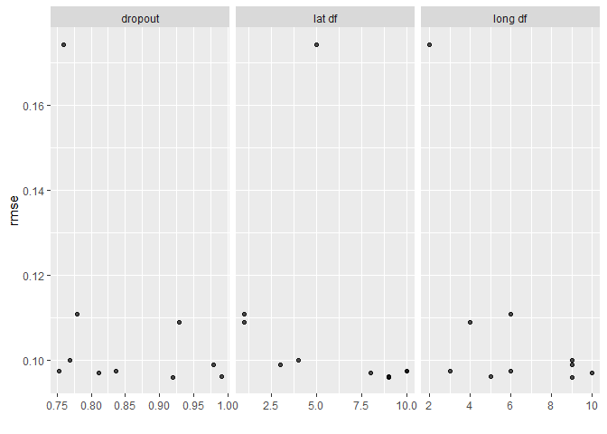

<!-- README.md is generated from README.Rmd. Please edit that file -->

# tidy.outliers

<!-- badges: start -->

[](https://www.tidyverse.org/lifecycle/#experimental)
[](https://CRAN.R-project.org/package=tidy.outliers)
[](https://codecov.io/gh/brunocarlin/tidy.outliers?branch=master)
[](https://github.com/brunocarlin/tidy.outliers/actions)
<!-- badges: end -->

The goal of tidy.outliers is to allow for easy usage of many outliers
removal methods, I currently plan to implement at least:

-   all methods in the [OutlierDetection
    package](https://cran.r-project.org/web/packages/OutlierDetection/index.html)
-   method of the [lookout package](https://github.com/Sevvandi/lookout)

## Installation

You can not yet install the released version of tidy.outliers from
[CRAN](https://CRAN.R-project.org) with:

``` r
#install.packages("tidy.outliers")
```

And the development version from GitHub with:

``` r
# install.packages("devtools")
devtools::install_github("brunocarlin/tidy.outliers")
```

## Example Mutation

This is a basic example which shows you how to solve a common problem:

### Load Libraries

``` r
library(recipes)
library(tidy.outliers)
library(OutlierDetection)
```

### Create recipe mutating probabilities

``` r
rec_obj <-
  recipe(mpg ~ ., data = mtcars) %>%
  step_outliers_maha(all_numeric(), -all_outcomes()) %>%
  step_outliers_lookout(all_numeric(),-contains(r"(.outliers)"),-all_outcomes()) %>% 
  prep(mtcars)
```

### Investigate results

``` r
juice(rec_obj) %>% 
  select(contains(r"(.outliers)")) %>% 
  arrange(.outliers_lookout %>% desc())
#> Registered S3 method overwritten by 'cli':
#>   method     from    
#>   print.boxx spatstat
#> # A tibble: 32 x 2
#>    .outliers_maha .outliers_lookout
#>             <dbl>             <dbl>
#>  1          0.959            1     
#>  2          0.967            0.506 
#>  3          0.951            0.403 
#>  4          0.654            0.108 
#>  5          0.864            0.0795
#>  6          0.741            0.0787
#>  7          0.411            0     
#>  8          0.374            0     
#>  9          0.222            0     
#> 10          0.192            0     
#> # ... with 22 more rows
```

``` r
tidy(rec_obj,number = 1)
#> # A tibble: 32 x 3
#>    index outlier_probability id                 
#>    <int>               <dbl> <chr>              
#>  1     1               0.411 outliers_maha_UScb9
#>  2     2               0.374 outliers_maha_UScb9
#>  3     3               0.222 outliers_maha_UScb9
#>  4     4               0.192 outliers_maha_UScb9
#>  5     5               0.124 outliers_maha_UScb9
#>  6     6               0.350 outliers_maha_UScb9
#>  7     7               0.481 outliers_maha_UScb9
#>  8     8               0.493 outliers_maha_UScb9
#>  9     9               0.985 outliers_maha_UScb9
#> 10    10               0.737 outliers_maha_UScb9
#> # ... with 22 more rows
```

``` r
tidy(rec_obj,number = 2)
#> # A tibble: 32 x 3
#>    index outlier_probability id                    
#>    <int>               <dbl> <chr>                 
#>  1     1                   0 outliers_lookout_jpLf8
#>  2     2                   0 outliers_lookout_jpLf8
#>  3     3                   0 outliers_lookout_jpLf8
#>  4     4                   0 outliers_lookout_jpLf8
#>  5     5                   0 outliers_lookout_jpLf8
#>  6     6                   0 outliers_lookout_jpLf8
#>  7     7                   0 outliers_lookout_jpLf8
#>  8     8                   0 outliers_lookout_jpLf8
#>  9     9                   0 outliers_lookout_jpLf8
#> 10    10                   0 outliers_lookout_jpLf8
#> # ... with 22 more rows
```

## Example filtering

### Create recipe filtering outliers

``` r
rec_obj2 <-
  recipe(mpg ~ ., data = mtcars) %>%
  step_outliers_maha(all_numeric(), -all_outcomes()) %>%
  step_outliers_lookout(all_numeric(),-contains(r"(.outliers)"),-all_outcomes()) %>% 
  step_outliers_remove(contains(r"(.outliers)")) %>% 
  prep(mtcars)
```

### Investigate results

We can see that the mtcars dataset got reduced by our function but way
less than if we used just one function on this case

``` r
juice(rec_obj2) %>% glimpse()
#> Rows: 31
#> Columns: 11
#> $ cyl  <dbl> 6, 6, 4, 6, 8, 6, 8, 4, 4, 6, 6, 8, 8, 8, 8, 8, 8, 4, 4, 4, 4,...
#> $ disp <dbl> 160.0, 160.0, 108.0, 258.0, 360.0, 225.0, 360.0, 146.7, 140.8,...
#> $ hp   <dbl> 110, 110, 93, 110, 175, 105, 245, 62, 95, 123, 123, 180, 180, ...
#> $ drat <dbl> 3.90, 3.90, 3.85, 3.08, 3.15, 2.76, 3.21, 3.69, 3.92, 3.92, 3....
#> $ wt   <dbl> 2.620, 2.875, 2.320, 3.215, 3.440, 3.460, 3.570, 3.190, 3.150,...
#> $ qsec <dbl> 16.46, 17.02, 18.61, 19.44, 17.02, 20.22, 15.84, 20.00, 22.90,...
#> $ vs   <dbl> 0, 0, 1, 1, 0, 1, 0, 1, 1, 1, 1, 0, 0, 0, 0, 0, 0, 1, 1, 1, 1,...
#> $ am   <dbl> 1, 1, 1, 0, 0, 0, 0, 0, 0, 0, 0, 0, 0, 0, 0, 0, 0, 1, 1, 1, 0,...
#> $ gear <dbl> 4, 4, 4, 3, 3, 3, 3, 4, 4, 4, 4, 3, 3, 3, 3, 3, 3, 4, 4, 4, 3,...
#> $ carb <dbl> 4, 4, 1, 1, 2, 1, 4, 2, 2, 4, 4, 3, 3, 3, 4, 4, 4, 1, 2, 1, 1,...
#> $ mpg  <dbl> 21.0, 21.0, 22.8, 21.4, 18.7, 18.1, 14.3, 24.4, 22.8, 19.2, 17...
```

``` r
mtcars %>% glimpse()
#> Rows: 32
#> Columns: 11
#> $ mpg  <dbl> 21.0, 21.0, 22.8, 21.4, 18.7, 18.1, 14.3, 24.4, 22.8, 19.2, 17...
#> $ cyl  <dbl> 6, 6, 4, 6, 8, 6, 8, 4, 4, 6, 6, 8, 8, 8, 8, 8, 8, 4, 4, 4, 4,...
#> $ disp <dbl> 160.0, 160.0, 108.0, 258.0, 360.0, 225.0, 360.0, 146.7, 140.8,...
#> $ hp   <dbl> 110, 110, 93, 110, 175, 105, 245, 62, 95, 123, 123, 180, 180, ...
#> $ drat <dbl> 3.90, 3.90, 3.85, 3.08, 3.15, 2.76, 3.21, 3.69, 3.92, 3.92, 3....
#> $ wt   <dbl> 2.620, 2.875, 2.320, 3.215, 3.440, 3.460, 3.570, 3.190, 3.150,...
#> $ qsec <dbl> 16.46, 17.02, 18.61, 19.44, 17.02, 20.22, 15.84, 20.00, 22.90,...
#> $ vs   <dbl> 0, 0, 1, 1, 0, 1, 0, 1, 1, 1, 1, 0, 0, 0, 0, 0, 0, 1, 1, 1, 1,...
#> $ am   <dbl> 1, 1, 1, 0, 0, 0, 0, 0, 0, 0, 0, 0, 0, 0, 0, 0, 0, 1, 1, 1, 0,...
#> $ gear <dbl> 4, 4, 4, 3, 3, 3, 3, 4, 4, 4, 4, 3, 3, 3, 3, 3, 3, 4, 4, 4, 3,...
#> $ carb <dbl> 4, 4, 1, 1, 2, 1, 4, 2, 2, 4, 4, 3, 3, 3, 4, 4, 4, 1, 2, 1, 1,...
```

And we can get which were the outliers and their probability

``` r
tidy(rec_obj2,number = 3) %>% 
  arrange(aggregation_results %>% desc())
#> # A tibble: 32 x 3
#>    index outliers aggregation_results
#>    <int> <lgl>                  <dbl>
#>  1    31 TRUE                   0.980
#>  2    29 FALSE                  0.736
#>  3    27 FALSE                  0.677
#>  4     9 FALSE                  0.493
#>  5    19 FALSE                  0.472
#>  6    28 FALSE                  0.410
#>  7    30 FALSE                  0.381
#>  8    21 FALSE                  0.372
#>  9    10 FALSE                  0.369
#> 10    24 FALSE                  0.347
#> # ... with 22 more rows
```

## Integration with tidymodels

### Load tidymodels

``` r
library(tidymodels)
```

### Get data

``` r
data(ames)


data_split <- ames %>%
  mutate(Sale_Price = log10(Sale_Price)) %>%
  initial_split(strata = Sale_Price)
ames_train <- training(data_split)
ames_test  <- testing(data_split)
```

### create the recipe

``` r
ames_rec <- 
  recipe(Sale_Price ~ Gr_Liv_Area + Longitude + Latitude, data = ames_train) %>% 
  step_log(Gr_Liv_Area, base = 10) %>% 
  step_ns(Longitude, deg_free = tune("long df")) %>% 
  step_ns(Latitude,  deg_free = tune("lat df")) %>% 
  step_outliers_maha(all_numeric(), -all_outcomes()) %>%
  step_outliers_lookout(all_numeric(),-contains(r"(.outliers)"),-all_outcomes()) %>% 
  step_outliers_remove(contains(r"(.outliers)"),probability_dropout = tune("dropout"))
```

### See the parameters

``` r
parameters(ames_rec)
#> Collection of 3 parameters for tuning
#> 
#>  identifier                type    object
#>     long df            deg_free nparam[+]
#>      lat df            deg_free nparam[+]
#>     dropout probability_dropout nparam[+]
```

### There is already a function for dropouts implemented by dials

``` r
ames_param <- 
  ames_rec %>% 
  parameters() %>% 
  update(
    `long df` = spline_degree(), 
    `lat df` = spline_degree(),
    dropout = dropout(range = c(0.75, 1))
  )
```

### Grid Search picks random points

``` r
spline_grid <- grid_max_entropy(ames_param, size = 10)
spline_grid
#> # A tibble: 10 x 3
#>    `long df` `lat df` dropout
#>        <int>    <int>   <dbl>
#>  1         9        3   0.752
#>  2         4        5   0.958
#>  3         2        7   0.769
#>  4        10        1   0.882
#>  5         7        3   0.996
#>  6         6        8   0.786
#>  7         2        1   0.817
#>  8         5        4   0.840
#>  9         5        8   0.898
#> 10         9        6   0.947
```

### create a simple model

``` r
lin_mod <-
  linear_reg() %>%
  set_engine("lm")
```

### create a simple workflow

``` r
wf_tune <- workflow() %>%
  add_recipe(ames_rec) %>% 
  add_model(lin_mod)
```

### create training folds

``` r
set.seed(2453)
cv_splits <- vfold_cv(ames_train, v = 10, strata = Sale_Price)
```

### Tune the grid

``` r
ames_res <- tune_grid(wf_tune, resamples = cv_splits, grid = spline_grid)
```

``` r
estimates <- collect_metrics(ames_res)

rmse_vals <- 
  estimates %>% 
  dplyr::filter(.metric == "rmse") %>% 
  arrange(mean)
rmse_vals
#> # A tibble: 10 x 9
#>    `long df` `lat df` dropout .metric .estimator   mean     n std_err .config   
#>        <int>    <int>   <dbl> <chr>   <chr>       <dbl> <int>   <dbl> <chr>     
#>  1         6        8   0.786 rmse    standard   0.0992    10 0.00229 Preproces~
#>  2         5        8   0.898 rmse    standard   0.0993    10 0.00224 Preproces~
#>  3         9        6   0.947 rmse    standard   0.100     10 0.00248 Preproces~
#>  4         9        3   0.752 rmse    standard   0.101     10 0.00240 Preproces~
#>  5         2        7   0.769 rmse    standard   0.102     10 0.00239 Preproces~
#>  6         7        3   0.996 rmse    standard   0.102     10 0.00219 Preproces~
#>  7         5        4   0.840 rmse    standard   0.102     10 0.00228 Preproces~
#>  8         4        5   0.958 rmse    standard   0.102     10 0.00230 Preproces~
#>  9        10        1   0.882 rmse    standard   0.109     10 0.00287 Preproces~
#> 10         2        1   0.817 rmse    standard   0.117     10 0.00288 Preproces~
```

## Plot it

``` r
autoplot(ames_res,metric = "rmse")
```


